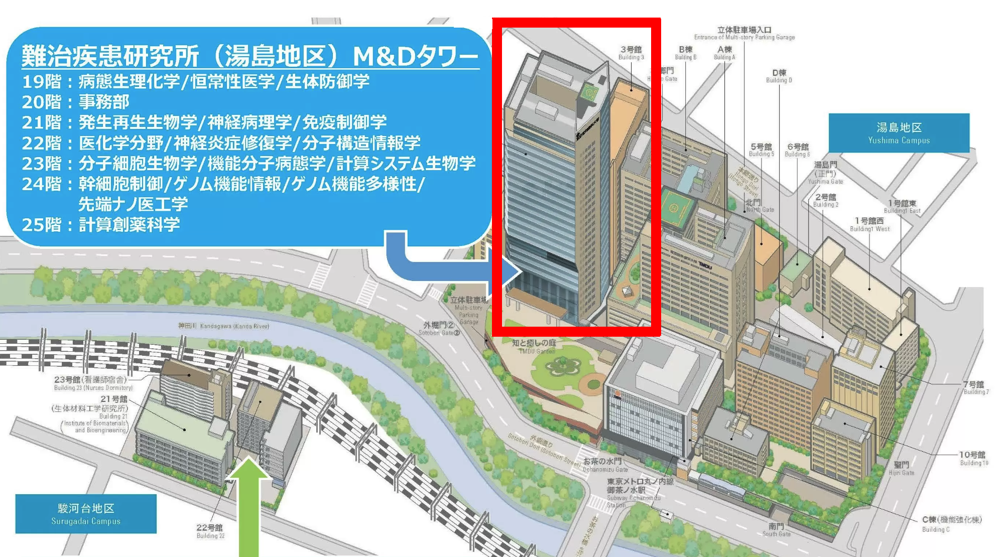

# 現在の活動

## 第1回研究会

### 開催概要

2025年12月10日に第1回研究会を行います。

- 日時：**2025年12月10日（水）13:00–17:00** （開場12:30）
- 場所：[東京科学大学 湯島キャンパス](https://www.isct.ac.jp/ja/001/access#anchor04)（旧東京医科歯科大学）**M&Dタワー 4階** [アクティブラーニング室](https://www.tmd.ac.jp/labs/TOGOjoho/toshokan-bumon/PCroom_59657a73c68be/)
- 懇親会：**17:30–19:00（2025.12.1更新：時間帯を若干変更しました）**＠ **M&Dタワー 26階 ファカルティラウンジ**

  - 最寄り駅
    - JR御茶ノ水駅（東京駅から約5〜10分）, お茶ノ水橋口改札から徒歩約5分
    - 東京メトロ丸ノ内線御茶ノ水駅, 1番または2番出口から徒歩約5分
    - 東京メトロ千代田線新御茶ノ水駅, B1出口から徒歩約8〜10分
  - 
  - 上図の赤枠で示した建物が発表会場および懇親会会場となるM&Dタワーです。 
  - キャンパス内に入りましたら、他の建物に入らずにM&Dタワーのふもとまでお越しいただき、**1階入口**からお入りください。他の建物からやM&Dタワーの2階からは入れないことがございます。1階のセブンイレブンの隣に入口がございます。
  - 1階入口の先にある防災センター（守衛室）にて記帳する必要はございません。
  - 防災センターの先の右側に6基のエレベーターがあります。こちらで4階にお上がりください。
  - この建物の1階入口は18時に自動的に施錠されます。中からは開けられますが、退出の際はご注意ください。
- 参加登録：~~[こちら]からお願いします。~~**2025.10.30更新：参加者数が上限に達したため受付を締め切りました**
- 参加費：参加登録リンクから詳細をご確認ください
- 設備
  - 110インチ中央モニタ 1台
  - 55インチ補助モニタ 2台
  - マイク
  - PC：無（持込可）
  - ​​​ネットワーク接続：無線LAN（ScienceTokyo Wi-Fi）またはEduroamが利用可能。
  - モニターへの出力：HDMI、アナログ、AppleTV
  - PCからの音声出力：HDMI
- [FAQ]({{ site.baseurl }}/faq/)

### タイムテーブル（予定・敬称略）

**リンクは[こちら](https://docs.google.com/spreadsheets/d/1iBQqqmWEbR4yX-kBbSmoy-0IOE4ZHVnYY-kGmu7jvKc/edit?usp=sharing)**

12:30 開場・受付開始 
13:00-13:10 開会挨拶・趣旨説明 
13:10-13:25 [小杉 貴洋](https://researchmap.jp/takahirokosugi) (分子科学研究所 協奏分子システム研究センター 助教) 
13:25-13:40 [千見寺 浄慈](https://researchmap.jp/read0132949) (名古屋大学 大学院工学研究科 応用物理学専攻 複合系物性工学 助教) 
13:40-13:55 [本田 信吾](https://researchmap.jp/shingo_honda) (Institute for Protein Design, University of Washington, Postdoctoral Scholar) 
13:55-14:10 [新津 藍](https://researchmap.jp/ai_niitsu) (理化学研究所 生命医科学研究センター チームディレクター) 
(休憩) 
14:30-14:45 [矢木 真穂](https://researchmap.jp/mahoyagi) (名古屋市立大学 大学院薬学研究科 准教授) 
14:45-15:00 [谷中 冴子](https://researchmap.jp/yanaka) (Science Tokyo 総合研究院 フロンティア材料研究所 准教授) 
15:00-15:15 [曽宮 正晴](https://researchmap.jp/masaharusomiya) (大阪大学 産業科学研究所 准教授) 
15:15-15:45 タンパク質デザインチュートリアル, [南 慎太朗](https://github.com/ShintaroMinami) (Accipiter Biosciences) & [本田 信吾](https://researchmap.jp/shingo_honda) (Institute for Protein Design, University of Washington, Postdoctoral Scholar) 
(休憩) 
16:05-16:20 [黒田 大祐](https://researchmap.jp/dkuroda1905) (日本大学 文理学部 生命科学科 准教授) 
16:20-16:35 **秋葉 凌羽** （東京科学大学 生命理工学院 学部3年）・ [森脇 由隆](https://researchmap.jp/YoshitakaMoriwaki) (Science Tokyo 総合研究院 難治疾患研究所 准教授)  
16:35-16:50 [坪山 幸太郎](https://researchmap.jp/ktsuboyama) (東京大学 生産技術研究所 講師) 
16:50-17:00 閉会挨拶 
17:30-19:00 懇親会 

### 開催趣旨

計算によるタンパク質デザインを始めとした生体分子の設計は現在急速に発展しています。ただし、その広範囲への応用の可能性を考えると、日本においてその技術の活用は限定的であると言わざるを得ません。その一つの原因として、これからタンパク質デザイン技術を取り入れたいと考えている研究者が、それぞれ独自に情報収集を行い、研究を進めていることが考えられます。また、これまでタンパク質デザインを行ってきた研究者であっても、その技術・知識が自身の研究の周辺に限られていることも少なくなく、全体への普及を難しくしています。この状況を前進させるためには、タンパク質デザインをはじめ生体分子設計を行っている研究者と、その技術を利用したいと考えている研究者が集まり、情報交換を行う機会を作ることが重要であると考え、今回研究会を企画しました。

初めての試みとなりますが、この会をきっかけとして、日本におけるタンパク質デザイン、さらには生体分子設計がこれまで以上に盛り上がっていくことを、オーガナイザー一同強く願っています。ぜひ、多数の皆様のご参加と活発なご議論をお願いいたします。

<!--

## 過去の活動

- なし

[Opening 1]({{ site.baseurl }}/downloads/GeneralPostdoc_2019_v01.pdf),
[Opening 2]({{ site.baseurl }}/downloads/PPMS_PhD_2019_v01.pdf),
[Opening 3]({{ site.baseurl }}/downloads/PD.pdf),
[Opening 4]({{ site.baseurl }}/downloads/PHD1.pdf),
[Opening 5]({{ site.baseurl }}/downloads/PHD2.pdf).

-->
